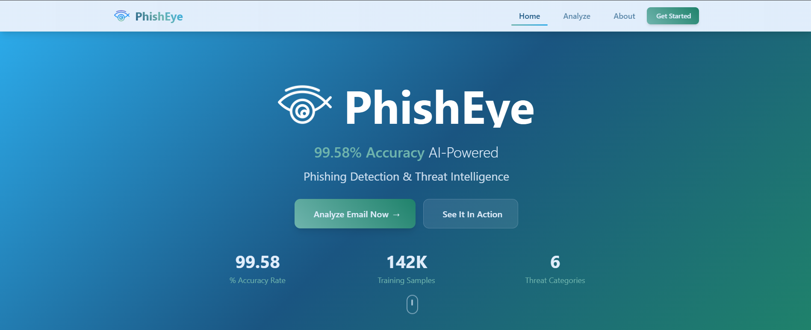
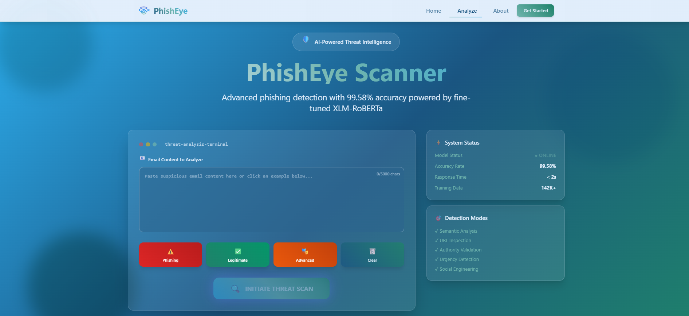
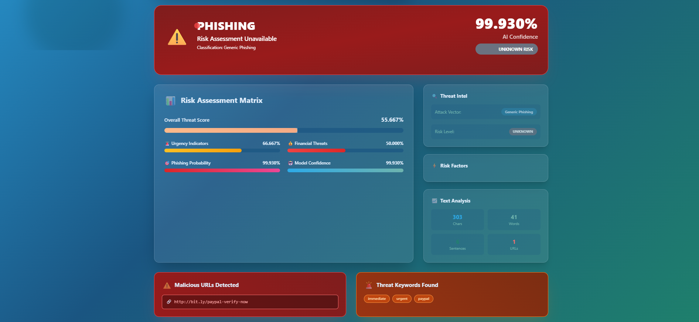

#PhishEye  
### AI-Driven Email Phishing Detection Platform  

PhishEye is an **AI-powered phishing detection system** that uses a fine-tuned transformer model to analyze email content in real time.  
It doesn’t just classify emails as *legitimate* or *phishing* — it also provides **detailed threat intelligence** to explain *why* an email is suspicious.  

---

## How It Works  

PhishEye is built on a **multi-tier architecture**:

1. **Frontend (Vue.js)**  
   - User-friendly cyberpunk-inspired interface  
   - Allows users to paste or upload emails for scanning  
   - Displays results with detailed threat metrics  

2. **Backend API (Laravel)**  
   - Acts as a bridge between the frontend and ML model  
   - Handles validation, error handling, and threat-level calculations  
   - Adds human-readable explanations and metadata  

3. **Machine Learning Core (Python FastAPI)**  
   - Powered by a fine-tuned **XLM-RoBERTa** transformer model  
   - Achieves **99.58% accuracy** on test data  
   - Provides detailed risk scores:
     - Urgency detection  
     - Financial threat indicators  
     - Authority impersonation  
     - Social engineering patterns  
     - Credential harvesting attempts  
     - Suspicious URL analysis  

---

## 📊 Example Workflow  

**Step 1**: Paste or upload an email into the frontend  
**Step 2**: Backend sends the request to the ML API  
**Step 3**: Model analyzes the content and returns:  
- Classification: Legitimate /  Phishing  
- Probability score (0–1)  
- Threat analysis breakdown  
- Human-readable summary  

**Step 4**: Results are displayed in a clear, visual dashboard with threat levels from *Minimal* to *Critical*.  

---

## Screenshots  

### Homepage  
  

### Demo: Scanner Page  
  

### Demo: Results Page  
  

### Logo  
  

---

## Datasets  

The PhishEye model was trained on **142,000+ emails**, including both legitimate and phishing samples from diverse campaigns.  
Due to GitHub’s file size limits, datasets are hosted on **Hugging Face**.  
 You can access the datasets here:  
[PhishEye Dataset on Hugging Face](https://huggingface.co/datasets/RikDecan/PhishEye)  

### Download rows directly with the API  

```bash
curl -X GET \
     "https://datasets-server.huggingface.co/rows?dataset=RikDecan%2FPhishEye&config=default&split=train&offset=0&length=100"
